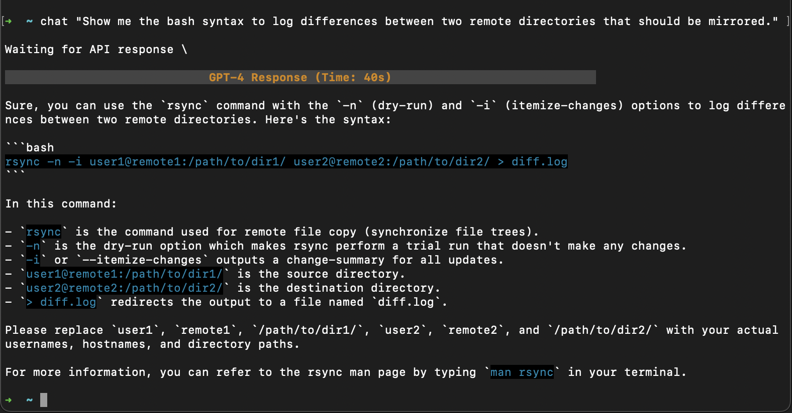
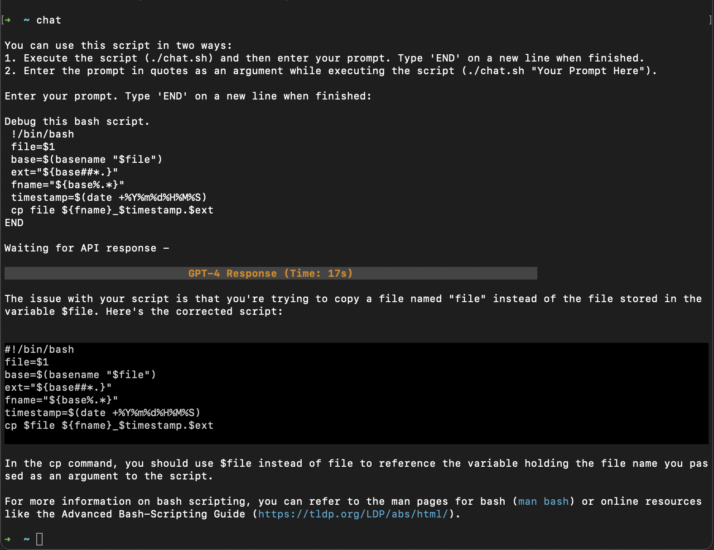

# OpenAI GPT-4 Chat Script

## Introduction
This script allows you to interact with OpenAI's GPT-4 model directly from your zsh terminal. It's a quick way to get help on command syntax or any query without leaving the terminal. The script has no memory so each interaction is independent.

## Setup Instructions
1. Copy this script to a directory in your `$PATH`. For example, `cp chat.sh /usr/local/bin/`.
2. Make it executable: `chmod +x /usr/local/bin/chat.sh`.
3. Create an alias in your bash config such as `~/.zshrc`: `alias chat=/usr/local/bin/chat.sh`.
4. Add your OpenAI API key as an environment variable. For example, add `export OPENAI_API_KEY=<your-api-key>` in `~/.zshrc`. [API Key Instructions](https://help.openai.com/en/articles/4936850-where-do-i-find-my-secret-api-key)
5. Install jq for JSON parsing: `brew install jq`. [Install instructions](https://formulae.brew.sh/formula/jq)

## Usage
You can prompt the script in two ways:

### Method 1: Inline Prompt
```
chat "Your query here."
```
- **Pros**: Quick for simple queries. Allows command chaining with pipes `|`.
- **Cons**: Cannot include the same type of quotes both inside and outside the query. Use a combination of double and single quotes if necessary. 

### Method 2: Multiline Prompt
```
chat
Your query here.
Additional lines if needed.
END
```
- **Pros**: Supports long queries and line breaks. Allows quotes inside the prompt.
- **Cons**: Requires manual typing of `END` to finish input.

## Examples
1. For a quick query: 



2. For a multiline query:



## Notes
- 8-bit ANSI text decorations are used to decorate the response. 16-bit colors may not work in all environments. Tweak the prompt to change color decorations. It's finicky. 
- Customize the system message as needed.
- TODO: Include support for light mode. (eww.) This version only works with dark themes. 

